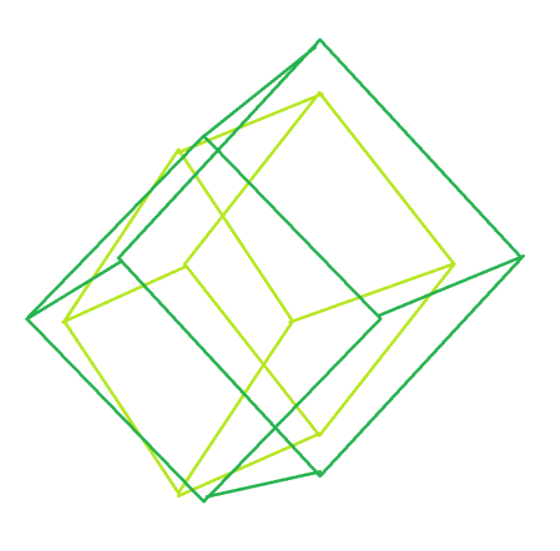

# SIMPLE-UI

SIMPLE-UI is a simple C++ graphical user interface (GUI) library designed to provide a lightweight and easy-to-use framework for building OpenGL-based GUI applications. The library is modular in design and supports the creation and management of GUI windows through classes such as Swindow, for developers who need an OpenGL environment and want to avoid complex dependencies.

By the way, this project is one of the *"SIMPLE" series* (and the first project of the *"SIMPLE" series*), whose main idea is to provide developers with easy-to-use frameworks, libraries, and software (completely open source).

The current version is not yet fully developed and is released to invite the community to participate in its development and maintenance, with more features and optimizations to come.

---

## Features

- **Based on OpenGL**: SIMPLE-UI uses OpenGL for rendering, so you can take full advantage of graphics hardware acceleration.
- **Modular design**: The modular design makes it easy to extend and maintain. Simplifies the creation and management of GUI applications by providing multiple classes.
- **No dependency on .lib and .dll files**: The lack of included .lib and .dll files means you don't need to configure complex library files. Just include the source files and compile directly.
- **Community-driven**: the current version is unfinished and aims to drive the project together through community contributions and feedback.

---

## Installation and configuration

### Dependencies

1. **OpenGL**: SIMPLE-UI uses OpenGL for graphics rendering, so you need to configure a valid OpenGL environment. You can use libraries like GLFW or SDL to create OpenGL contexts.
   
2. **C++ compiler**: C++17 and above compilers are supported.

2. **Event Handling**: Through the interface provided by this project, you can easily handle user input events.

3. **Extension**: SIMPLE-UI is designed to be modular, you can extend more window controls and functions as needed.

---

## License

SIMPLE-UI is licensed under the [MIT License](https://opensource.org/licenses/MIT), and you are free to use, modify, and distribute the software, provided that the copyright notice and license information are retained.
(If you are one of the contributors to the project, you can ignore this requirement and do not need to declare the copyright owner.)

---

## Contribute

SIMPLE-UI is an open source project and anyone is welcome to contribute:

- Provide bug reports and feature requests.
- Help improve documentation and sample code.

If you want to submit bug feedback or improvement suggestions/code, pls send mail to *BF_bug_feedback@126.com*.

---

## Contact information

- **Copyright owner**: [*Tianxiaoxiao1021*](https://github.com/Tianxiaoxiao1021)
- **Year**: 2024

----

This project is updated on a monthly basis, and in the event of a major error or significant update, we will submit changes to the repository in a timely manner.

Thank you for your use and contribution!
